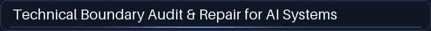
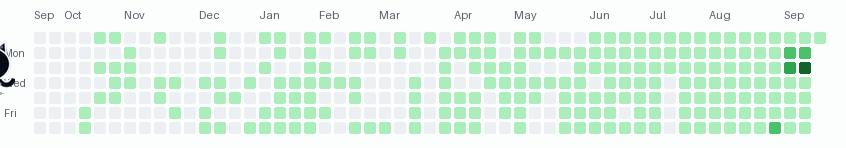

# GitHub Profile Motion

Self-contained GIFs for a GitHub profile README. The animated squares are an illustration over a dated contribution snapshot; this does **not** edit GitHub's real contribution graph.

<picture>
  <source media="(max-width: 600px)" srcset="heading_mobile.gif">
  
</picture>



An [alternative fox, one-image character and warm palette](fox.gif) uses the same renderer. These checked-in GIFs are **fixed examples**: the cat uses a public `shin4141` snapshot captured on 2026-09-20; the fox uses **synthetic** counts. Neither is a live graph or a claim about today's activity.

## Make one with your character

Python 3.10+ is required. Clone this repository, then run the following from its root:

```sh
python3 -m venv .venv
source .venv/bin/activate
python -m pip install -r requirements.txt
python render.py --config cat.json --activity shin_activity_2026-09-20.json --seed 216 --out my-profile.gif
```

`my-profile.gif` is your first generated copy of the crowned-cat example. For your own version:

1. Save your icon as `your-icon.png` next to `render.py` (PNG, JPEG, or another Pillow-readable image; a transparent square icon looks best). Copy `config.example.json` to `my-config.json`; replace `YOUR_LOGIN` with your GitHub username, and change `icon`, `accent`, and `glow` to your image filename and `#RRGGBB` colors. The image path is relative to `render.py`, not your shell's current directory.
2. Make a clearly **synthetic** test snapshot for that username, then render it:

   ```sh
   python render.py --sample my-activity.json --username YOUR_LOGIN
   python render.py --config my-config.json --activity my-activity.json --out my-profile.gif
   ```

Only one icon image is necessary: it bobs, tilts, rests and wakes in both scenes. The cat's `sleep_icon` and `wake_icon` are optional extra poses; omit both keys for a single-image character, as in `fox.json`. No custom animation frames or drawing program are needed.

For **your real public contribution data**, install the [GitHub CLI](https://cli.github.com/) and authenticate with `gh auth login` on your own machine. `gh auth status` should succeed; `gh api graphql` requires a token accepted by GitHub's GraphQL API. This renderer asks only for `user(login: ...) { contributionsCollection { contributionCalendar { ... } } }`; the account used for capture must be permitted to view that user's contribution calendar. Do not paste tokens into config files, commits, or issues. Run:

```sh
python render.py --capture my-activity.json --username YOUR_LOGIN
python render.py --config my-config.json --activity my-activity.json --out my-profile.gif
```

Capture defaults to the last 196 UTC calendar days; use `--from-date YYYY-MM-DD --to-date YYYY-MM-DD` to set the range explicitly. Re-run these two commands whenever you want a new static snapshot/GIF, then commit the new GIF to the repository that serves your profile. The capture JSON includes `observed_at`; review it before publishing. Public counts can differ from what you expect because of GitHub's contribution and privacy rules. `--sample` is synthetic and never queries GitHub; `--capture` is the authenticated real-data path. There is no scheduled service or automatic update.

Commit `my-profile.gif` to your special `YOUR_LOGIN/YOUR_LOGIN` profile repository and put this in its `README.md`:

```md

```

If the GIF stays in this repository instead, reference an immutable commit, for example `https://raw.githubusercontent.com/OWNER/github-profile-motion/COMMIT/my-profile.gif`. A moving title is optional: `python render.py --heading-out heading.gif --heading-mobile-out heading_mobile.gif`, then use a `<picture>` element like the one above. The sample heading text is fixed in `render.py`; edit `HEADING` if your profile needs different words. Keep meaningful `alt` text: a reduced-motion client may show only frame one.

## What is included

- `render.py` makes deterministic, script-free GIFs from an icon, palette, seed, and dated JSON. The two-scene `shock` loop is the default. `--pattern touch` is a retained alternate, not another required sprite set.
- `cat.json` plus `crowned_cat*.png` are the ready-to-run character; `fox.json` and `fox.png` demonstrate one-image substitution. `make_icons.py` regenerates these original small icons.
- `shin_activity_2026-09-20.json` is a frozen public GitHub GraphQL snapshot; `example_activity.json` is explicitly synthetic. Each activity file contains a `username` and `days` entries with `date` and nonnegative integer `count`; the username must match the config. Rendering does not modify input counts.
- `test_render.py` checks stable frames, two-scene continuity, input preservation, and alternate-icon output. Run `python -m unittest -v test_render` after installing dependencies.

Code and original included artwork are available under [MIT](LICENSE). The renderer, config, icons, examples, and tests were extracted from [Decision-OS V13 LoopKit at `a3c3e6633b13684adc08beab28883a57b11d5cbb`](https://github.com/shin4141/decision-os-v13-loopkit/tree/a3c3e6633b13684adc08beab28883a57b11d5cbb/examples/profile_motion); that repository holds the design/decision history and [Aspire entry](https://github.com/shin4141/decision-os-v13-loopkit). This repository is the canonical place for future generator changes. See the [live example on Shin's profile](https://github.com/shin4141).
